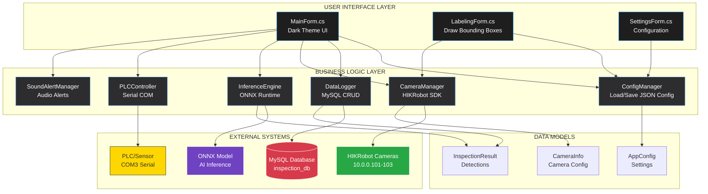
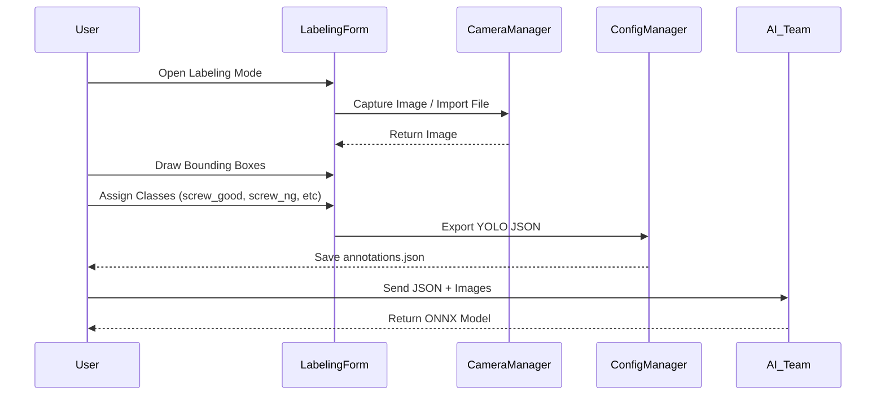
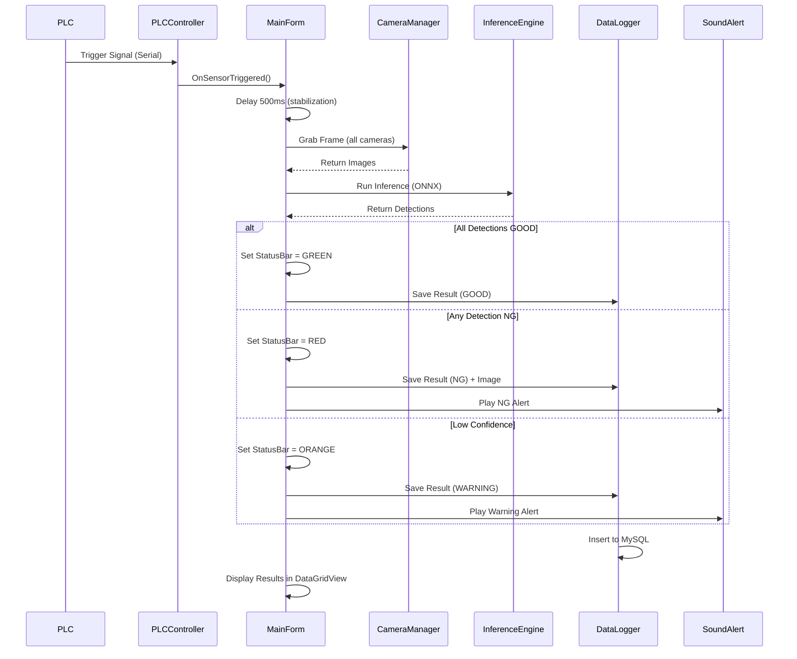
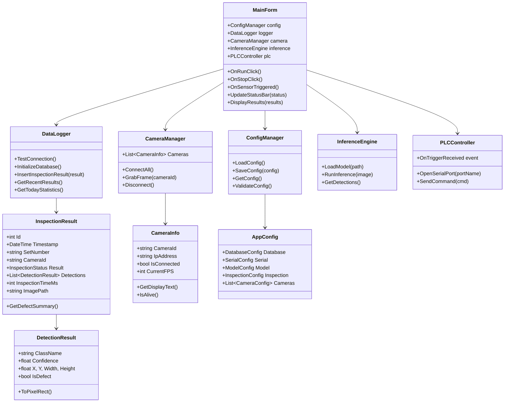
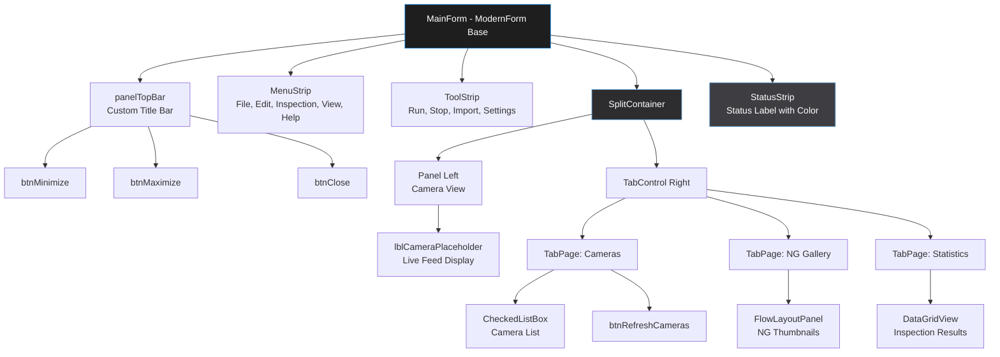
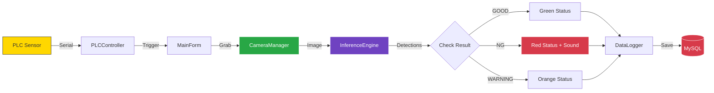

# 🏗️ INSPECTION AI PLATFORM - ARCHITECTURE

## 📊 SYSTEM ARCHITECTURE DIAGRAM



---

## 🔄 WORKFLOW DIAGRAM

### TRAINING PHASE (User → AI Team)



---

### INSPECTION PHASE (Production)



---

## 📁 CLASS DIAGRAM



---

## 🎨 UI COMPONENT HIERARCHY



---

## 🔌 EXTERNAL INTEGRATIONS

### 1. HIKRobot Camera SDK
```
MvCameraControl.dll (64-bit)
├── MV_CC_CreateHandle()
├── MV_CC_OpenDevice()
├── MV_CC_StartGrabbing()
├── MV_CC_GetOneFrameTimeout()
└── MV_CC_CloseDevice()
```

### 2. ONNX Runtime
```
Microsoft.ML.OnnxRuntime
├── InferenceSession.Run()
├── Input: float[1,3,640,640]
├── Output: float[1,25200,85]
└── Post-processing: NMS, Threshold
```

### 3. MySQL Database
```sql
inspection_results
├── id (PK)
├── timestamp
├── set_number
├── camera_id
├── result (GOOD/NG/WARNING)
├── defect_summary
└── inspection_time_ms

detection_details
├── id (PK)
├── inspection_id (FK)
├── class_name
├── confidence
└── bbox coordinates
```

### 4. Serial PLC Communication
```
System.IO.Ports.SerialPort
├── PortName: COM3
├── BaudRate: 9600
├── DataReceived Event
└── Trigger Command: 0x01
```

---

## 📊 DATA FLOW



---

## 🚀 DEPLOYMENT ARCHITECTURE

```
Factory Floor
├── Station 1
│   ├── PC (Windows 10)
│   ├── Camera 1-3 (HIKRobot)
│   ├── PLC (Serial COM3)
│   └── InspectionAI.exe
│
├── Station 2
│   ├── PC (Windows 10)
│   ├── Camera 1-2
│   └── InspectionAI.exe
│
└── Central MySQL Server
    ├── IP: 192.168.1.100
    ├── Port: 3306
    └── Database: inspection_db
```

---

**Author:** Claude AI  
**Version:** 1.0  
**Last Updated:** January 2026
